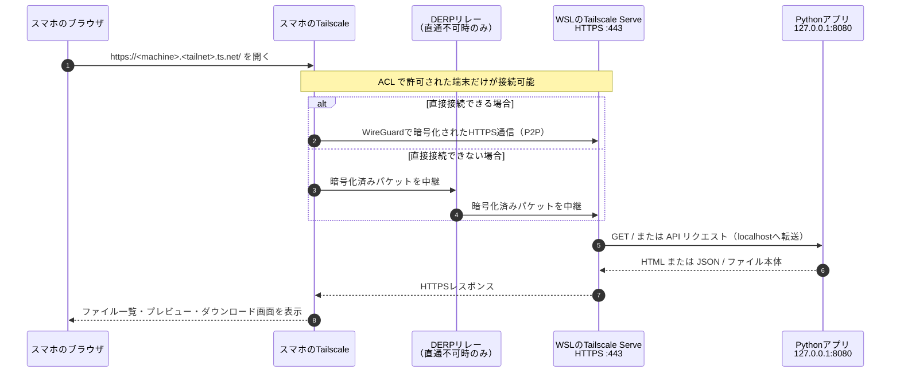

# WSL + Tailscale: プライベートファイル共有

依存パッケージなしの Python ファイル共有アプリです。アプリ自体は `127.0.0.1:8080` にのみ待ち受けます。外出中のスマホへは、**Tailscale Serve** が Tailnet 内限定の HTTPS として公開します。インターネット全体に公開する Funnel は使いません。

## 初回セットアップ

WSL の Ubuntu で次を実行します。Tailscale の認証 URL が表示されたら、スマホで使うのと同じ Tailnet のアカウントで認証してください。

```bash
curl -fsSL https://tailscale.com/install.sh | sh
sudo tailscale up
```

スマホ側にも Tailscale アプリを入れ、同じ Tailnet へサインインして接続状態にします。

## 接続シーケンス

アプリは WSL の外部ネットワークには直接待ち受けません。名前解決・端末認証後、スマホと WSL の Tailscale は原則として直接通信し、WSL 上の Tailscale Serve が `127.0.0.1:8080` の Python アプリへリバースプロキシします。直通できないネットワーク環境では、暗号化済みパケットだけが DERP リレーを通ります。



## 起動と公開

```bash
./scripts/start.sh
./scripts/publish-tailscale.sh
```

2 個目のコマンドが表示する `https://<マシン名>.<tailnet名>.ts.net/` をスマホで開いてください。ファイル一覧が表示されれば、Tailnet 経由の接続を確認できます。

## ファイルの使い方

- `data/downloadable/` に置いたファイルは「ダウンロード」一覧に表示されます。10 件ごとのページング、画像・PDF・テキストのプレビュー、ダウンロードに対応しています。
- 画面からアップロードしたファイルは `data/uploaded/` に保存されます。アップロード済み一覧からダウンロードまたは削除できます。同名ファイルは上書きせず、連番を付けて保存します。
- 1 回のアップロードは合計 100 MiB までです。テキストプレビューは 256 KiB までです。

たとえば WSL のターミナルから公開用ファイルを置くには以下を実行します。

```bash
cp /path/to/file data/downloadable/
```

ローカルでの確認は以下です。

```bash
curl http://127.0.0.1:8080/healthz
```

停止するには以下を実行します。

```bash
./scripts/stop.sh
tailscale serve reset
```

## WSL について

この構成は WSL を起動している間に動きます。PC がスリープ中・再起動後・WSL が終了した後はアクセスできません。常時公開が必要なら、次の段階として Windows 起動時の WSL 起動とアプリ常駐化を設定してください。

`tailscale serve` の設定は Tailscale 側に残るため、アプリを止めている間は HTTPS 側が 502 になります。公開を止める場合は必ず `tailscale serve reset` を実行してください。

## セキュリティの要点

- アプリの待受先は `127.0.0.1` 固定なので、Windows LAN や直接のインターネット公開にはなりません。
- 接続できるのは Tailnet の ACL で許可された端末だけです。必要なら Tailscale 管理画面でこの WSL マシンへのアクセスを制限してください。
- アップロード済みファイルは WSL の `data/uploaded/` にそのまま保存されます。不要なファイルは画面から削除してください。
- アプリ内の利用者ごとのログインや権限分けはありません。Tailnet の ACL で許可された端末はファイルのアップロード・削除を実行できます。
